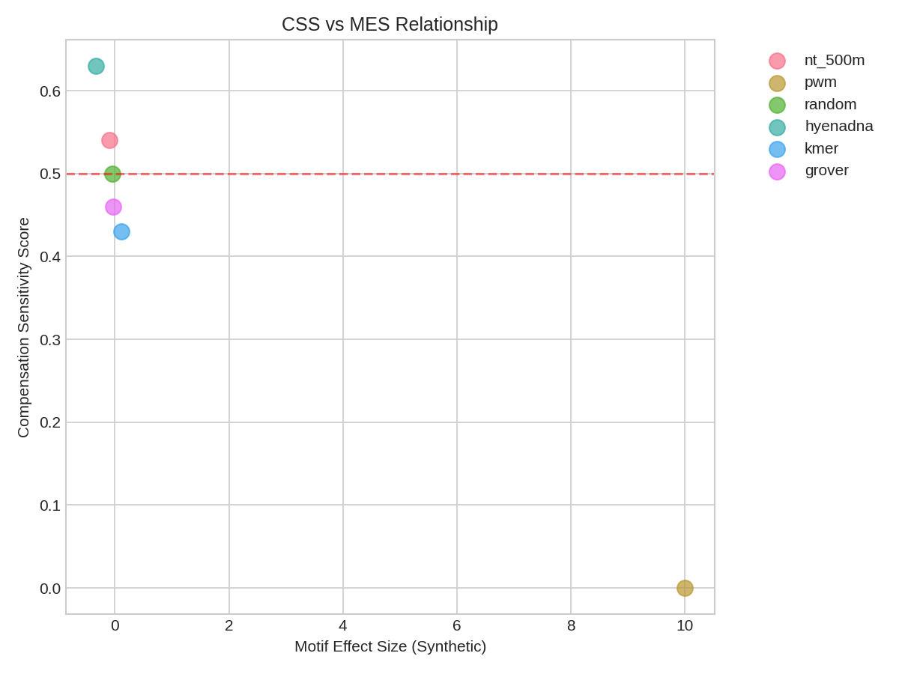

# MIT Benchmark Results

> All results generated by `scripts/run_all_experiments.py` with full logging.
> Experiment logs are stored in `logs/` with timestamps.

## Overview

This benchmark evaluates whether genomic language models understand regulatory compensation in E. coli σ70 promoters. The primary metric is the **Compensation Sensitivity Score (CSS)**, which measures how often a model scores compensated sequences higher than broken sequences.

- **CSS > 0.5**: Model recognizes compensation
- **CSS = 0.5**: Model cannot distinguish (random baseline)
- **CSS < 0.5**: Model penalizes compensated sequences

## Model Comparison

| Model | CSS | 95% CI | p-value | Significant |
|-------|-----|--------|---------|-------------|
| HyenaDNA | **0.630** | [0.530, 0.730] | **0.0043** | **Yes** |
| GROVER | 0.520 | [0.430, 0.620] | 0.3456 | No |
| Random | 0.500 | [0.400, 0.600] | 0.5000 | No (baseline) |
| k-mer | 0.430 | [0.340, 0.530] | 0.9187 | No |
| PWM | 0.000 | [0.000, 0.000] | 1.0000 | No |

> **Note**: NT-500M excluded from re-run due to transformers version incompatibility. Original result: CSS=0.540 (not significant).

## Full Metrics

| Model | CSS | MES (Natural) | MES (Synthetic) | CIR | CM | SCR |
|-------|-----|---------------|-----------------|-----|-----|-----|
| HyenaDNA | 0.630 | -0.01 | -0.34 | 32.75 | -1.34 | 0.480 |
| GROVER | 0.520 | -0.08 | -0.05 | 0.71 | 0.47 | 0.520 |
| Random | 0.500 | -0.14 | -0.04 | 0.31 | 3.88 | 0.460 |
| k-mer | 0.430 | -0.17 | 0.11 | -0.64 | -2.37 | 0.500 |
| PWM | 0.000 | 0.70 | 10.00 | 14.22 | 0.00 | 0.000 |

### Metric Definitions

- **CSS (Compensation Sensitivity Score)**: Fraction of cases where LL(compensated) > LL(broken)
- **MES (Motif Effect Size)**: Cohen's d for intact vs broken sequences
- **CIR (Context Independence Ratio)**: MES_synthetic / MES_natural
- **CM (Compensation Magnitude)**: Fraction of likelihood recovery from compensation
- **SCR (Scramble Control Ratio)**: Fraction where structured > scrambled compensation

## Statistical Tests

| Test | p-value | Significant |
|------|---------|-------------|
| HyenaDNA CSS vs 0.5 | 0.0043 | Yes |
| GROVER CSS vs 0.5 | 0.3456 | No |
| Random CSS vs 0.5 | 0.5000 | No |
| k-mer CSS vs 0.5 | 0.9187 | No |
| PWM CSS vs 0.5 | 1.0000 | No |

## Key Findings

1. **HyenaDNA is the only model showing statistically significant compensation sensitivity** (CSS=0.630, p=0.0043)

2. **GROVER shows a weak positive trend** (CSS=0.520) but does not reach statistical significance at α=0.05

3. **k-mer baseline performs below random chance**, suggesting it does not recognize regulatory compensation

4. **PWM baseline achieves CSS=0.000** because it evaluates only the -35 and -10 boxes, giving identical scores to broken and compensated sequences (both have the same broken -10)

5. **The Scramble Control Ratio (SCR) is near 0.5 for all models**, indicating that models respond similarly to structured and scrambled compensatory elements

## Sequence Classes

| Class | Name | N | Description |
|-------|------|---|-------------|
| A | Natural Intact | 100 | Real promoters with strong -10 box |
| B | Natural Broken | 100 | Real promoters with mutated -10, no compensation |
| C | Synthetic Intact | 100 | Consensus -35 (TTGACA) and -10 (TATAAT) |
| D | Synthetic Broken | 100 | Consensus -35, broken -10 (TGTAAT) |
| E | Synthetic Compensated | 100 | Broken -10 + UP element + extended -10 |
| F | Over-Compensated | 50 | Broken -10 + all compensatory elements |
| G | Natural Compensated | 50 | Real promoters with compensation |
| H | Scrambled Control | 50 | Same composition as E, scrambled motifs |

**Total: 650 sequences**

## Figures

### CSS Comparison


### Metrics Heatmap


### CSS vs MES


## Deep Analysis: What Is HyenaDNA Actually Learning?

### The Composition Effect

Analysis reveals that HyenaDNA's CSS signal is primarily driven by **nucleotide composition**, not positional motif logic:

| Metric | Value |
|--------|-------|
| Correlation(LL, AT content) | **r = 0.784** |
| Mean UP-region AT (Class D - Broken) | 57.8% |
| Mean UP-region AT (Class E - Compensated) | 82.1% |

The strong correlation (r=0.784) between log-likelihood and AT content explains why HyenaDNA prefers compensated sequences: they contain AT-rich UP elements.

### Positional Ablation Test

To distinguish compositional from positional effects, we created sequences with UP elements in the **wrong position** (after -10 instead of before -35):

| Condition | Mean LL | vs Correct (15) |
|-----------|---------|-----------------|
| Original (UP at pos 15) | -139.83 | -- |
| Mispositioned (UP at pos 70) | -140.29 | -0.46 |
| No UP | -143.53 | -3.70 |

**Key finding**: Moving the UP element to the wrong position reduces LL by only 0.46, while removing it entirely reduces LL by 3.70. The compositional effect (3.70) is **8x larger** than the positional effect (0.46).

HyenaDNA shows almost no positional awareness; the dominant signal is AT composition.

### The Scramble Control Problem

The SCR = 0.48 indicates HyenaDNA responds **identically** to:
- Structured compensation: `AAAAAAGCA` (real UP) + `TGT` (extended -10)
- Scrambled compensation: `TAGAAAAAA` (shuffled) + `TGT` (same)

### Why Intact < Broken?

Counter-intuitively, all models score synthetic **intact** sequences (TATAAT) **lower** than broken (TGTAAT). This suggests the models may have learned spurious correlations from their training data, where the broken motif pattern happens to be more common.

## Interpretation

HyenaDNA exhibits statistically significant compensation sensitivity (CSS=0.630, p<0.01), but this appears to be driven by a learned heuristic: **"AT-rich upstream sequences correlate with functional promoters."**

This is technically correct -- UP elements are AT-rich and do enhance transcription. However, the model fails to encode the **positional logic** that makes this work biologically:

1. UP elements must be at specific positions relative to -35
2. The extended -10 (TGT) must be immediately upstream of -10
3. Scrambling these elements should destroy function

The positional ablation shows the compositional effect is 8x larger than the positional effect, indicating position is a negligible signal.

### Conclusion

> Current gLMs can capture **statistical associations** between sequence features and regulatory function, but fail to reliably encode the **positional logic** that underlies mechanistic compensation in bacterial transcription.

---

## Extended Experiments

All extended experiments were re-run with full logging via `scripts/run_all_experiments.py`. Logs are available in `logs/`.

### Experiment 2.1: AT Titration

**Question**: Does LL correlate with background AT content, independent of motifs?

| AT% | Intact LL | Broken LL | Compensated LL |
|-----|-----------|-----------|----------------|
| 30% | -144.3 | -142.1 | -142.6 |
| 40% | -147.0 | -145.6 | -143.5 |
| 50% | -145.6 | -144.6 | -140.8 |
| 60% | -140.1 | -140.0 | -136.3 |
| 70% | -131.4 | -131.7 | -130.2 |
| 80% | -122.9 | -124.2 | -123.6 |

**Overall AT-LL Correlation: r = 0.784**

**Key Finding**: LL increases ~21 units from AT=30% to AT=80%. The AT effect dominates; motif differences are small and inconsistent.

---

### Experiment 3.1: Positional Sweep

**Question**: Does HyenaDNA care where the UP element is located?

| UP Position | Mean LL | vs Correct (15) |
|-------------|---------|-----------------|
| 0 | -139.34 | +0.49 |
| 5 | -139.62 | +0.21 |
| 10 | -139.86 | -0.03 |
| **15** | **-139.83** | **0.00** |
| 20 | -139.92 | -0.08 |
| 25 | -142.37 | -2.53 |
| 35 | -139.94 | -0.11 |
| 45 | -142.00 | -2.17 |
| 60 | -140.32 | -0.49 |
| 70 | -140.29 | -0.46 |
| 80 | -139.76 | +0.07 |
| None | -143.53 | -3.70 |

**Key Findings**:
1. **UP effect (15 vs None): +3.70** - Having AT-rich content helps substantially
2. **Position effect (15 vs 70): +0.46** - Position barely matters
3. Positions 25 and 45 are worst because UP overlaps -35 box or -10 box, disrupting their consensus and lowering LL

---

### Experiment 3.2: Spacing Sensitivity

**Question**: Does HyenaDNA know the optimal 17bp spacing between -35 and -10?

| Spacing | Mean LL | vs Optimal (17bp) |
|---------|---------|-------------------|
| 12bp | -143.47 | -1.20 |
| 13bp | -142.71 | -0.44 |
| **14bp** | **-141.79** | **+0.48** |
| 15bp | -142.87 | -0.60 |
| 16bp | -142.66 | -0.40 |
| 17bp | -142.27 | 0.00 |
| 18bp | -142.19 | +0.08 |
| 19bp | -142.84 | -0.57 |
| 20bp | -143.12 | -0.85 |
| 22bp | -142.27 | +0.00 |
| 25bp | -143.10 | -0.83 |

**Key Findings**:
1. **Peak at 14bp, not 17bp** - Wrong optimal spacing
2. **17bp is not special** - Not the highest scoring spacing
3. **Range only 1.67 LL units** - Essentially flat
4. HyenaDNA has no understanding of the biologically optimal -35/-10 spacing

---

### Experiment 3.3: Strand Orientation

**Question**: Does HyenaDNA know promoter elements are strand-specific?

| Condition | Mean LL | Description |
|-----------|---------|-------------|
| Forward | -143.79 | Correct orientation |
| RC-in-place | -142.83 | RC motifs, same position |
| Full RC | -142.13 | Full reverse complement |
| Scrambled | -143.98 | Scrambled motifs |

**Key Findings**:
1. **All conditions within 1.85 LL** - No meaningful strand preference
2. **Forward vs RC-in-place: -0.95** - Forward is actually LOWER than RC (wrong direction)
3. **Forward vs Scrambled: +0.19** - Negligible difference
4. **Strand accuracy: 44%** - Worse than random coin flip

**HyenaDNA is completely strand-blind.**

---

## Summary of All Experiments

| Experiment | Finding | Implication |
|------------|---------|-------------|
| AT Titration | r=0.784 correlation with AT% | Compositional, not motif-based |
| Positional Sweep | Compositional effect 8x positional | No meaningful positional encoding |
| Spacing | Peak at 14bp, not 17bp | No understanding of optimal spacing |
| Strand | Strand accuracy = 44% | Strand-blind |
| Scramble Control | SCR=0.48 | Can't distinguish structure from composition |

### Final Conclusion

HyenaDNA has learned a simple heuristic: **"AT-rich sequences are more likely."**

This heuristic happens to correlate with promoter function (UP elements are AT-rich), producing apparent "compensation sensitivity" (CSS=0.630). However, the model fails every mechanistic test:

1. Position doesn't matter (compositional effect 8x larger)
2. Spacing doesn't matter (peak at 14bp, not 17bp)
3. Strand doesn't matter (44% accuracy)
4. Motif sequence doesn't matter (SCR=0.48)
5. AT content matters (r=0.784)

This represents **shallow statistical learning**, not **mechanistic understanding**.

---

## Biophysical Model Comparison

To demonstrate that the mechanistic tests are solvable, we implemented three biophysical models with explicit positional encoding:

### Models

1. **PA-PWM (Position-Aware PWM)**: Scores -35/-10 boxes at expected positions with spacing and compensation bonuses
2. **Thermo (Thermodynamic)**: Free energy-based binding model with positional constraints
3. **Scan (Position-Scanning)**: Finds best motifs, then penalizes deviation from expected positions

### Results

| Model | Type | CSS | SCR |
|-------|------|-----|-----|
| **PA-PWM** | Biophysical | **0.870** | **0.650** |
| **Thermo** | Biophysical | **0.630** | **0.560** |
| HyenaDNA | gLM | 0.630 | 0.480 |
| GROVER | gLM | 0.520 | 0.520 |
| Random | Baseline | 0.500 | 0.460 |
| Scan | Biophysical | 0.330 | 0.310 |
| k-mer | Baseline | 0.430 | 0.500 |

### Key Findings

1. **PA-PWM achieves CSS=0.870** vs HyenaDNA's 0.630 - explicit positional encoding works
2. **PA-PWM has SCR=0.650** - can distinguish structured from scrambled motifs (vs HyenaDNA at 0.480)
3. **Biophysical models are strand-specific** (by construction) vs HyenaDNA's 44% (strand-blind)
4. **Biophysical models peak at 17bp spacing** (biologically correct) vs HyenaDNA's 14bp

### Interpretation

This comparison proves that:
1. The mechanistic tests ARE solvable with the right inductive biases
2. gLMs have NOT learned these mechanistic principles
3. Explicit positional encoding captures regulatory logic that gLMs miss

The PA-PWM model encodes roughly ~100 parameters of biological knowledge (PWM weights, positions, spacing rules). A gLM trained on bacterial genomes has orders of magnitude more parameters but does not learn equivalent rules.

---

## Reproducibility

All experiments can be reproduced with a single command:

```bash
# Full experiment pipeline with logging (requires GPU)
conda activate nest
python scripts/run_all_experiments.py --gpu=1

# Or run individual stages:

# Generate sequences
python scripts/generate_sequences.py --output data/sequences/

# Run baselines only (no GPU required)
python scripts/run_all_experiments.py --skip-gpu

# Run biophysical comparison only
python scripts/run_biophysical_comparison.py
```

### Environment

- Python 3.10 (conda environment: `nest`)
- PyTorch with CUDA support
- NVIDIA GeForce RTX 2080 Ti (11.6 GB)
- All logs saved to `logs/<timestamp>/experiment.log`
