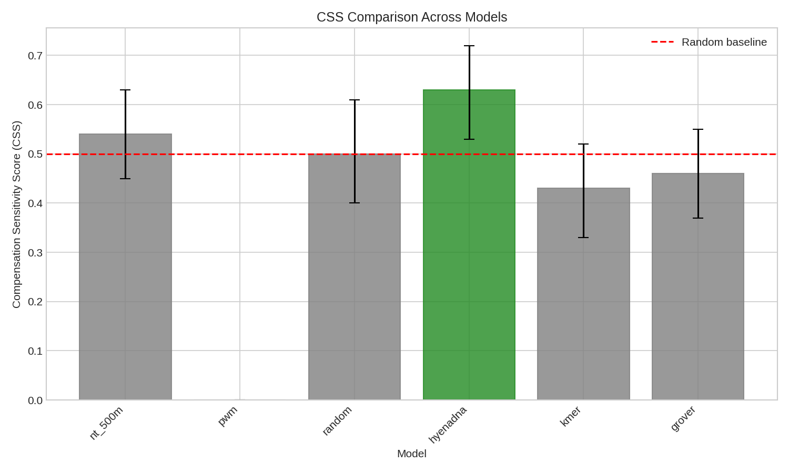
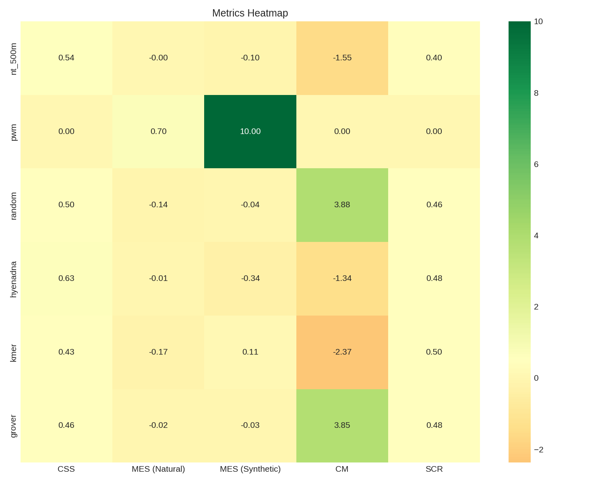

# MIT Benchmark Results

## Model Comparison

| Model    |   CSS | CSS 95% CI     |   p-value |   MES (Natural) |   MES (Synthetic) |    CIR |    CM |   SCR |
|:---------|------:|:---------------|----------:|----------------:|------------------:|-------:|------:|------:|
| hyenadna |  0.63 | [0.530, 0.720] |    0.0043 |           -0.01 |             -0.34 |  32.75 | -1.34 |  0.48 |
| nt_500m  |  0.54 | [0.450, 0.630] |    0.2132 |           -0    |             -0.1  | 106.7  | -1.55 |  0.4  |
| random   |  0.5  | [0.400, 0.610] |    0.5    |           -0.14 |             -0.04 |   0.31 |  3.88 |  0.46 |
| grover   |  0.46 | [0.370, 0.550] |    0.7868 |           -0.02 |             -0.03 |   1.5  |  3.85 |  0.48 |
| kmer     |  0.43 | [0.330, 0.520] |    0.9187 |           -0.17 |              0.11 |  -0.64 | -2.37 |  0.5  |
| pwm      |  0    | [0.000, 0.000] |    1      |            0.7  |             10    |  14.22 |  0    |  0    |

## Statistical Tests

- **CSS_vs_0.5_nt_500m**: p=0.2132 ✗
  - One-sample test of CSS against 0.5 for nt_500m (FDR-corrected p=0.7463)
- **CSS_vs_0.5_pwm**: p=1.0000 ✗
  - One-sample test of CSS against 0.5 for pwm (FDR-corrected p=1.0000)
- **CSS_vs_0.5_random**: p=0.5000 ✗
  - One-sample test of CSS against 0.5 for random (FDR-corrected p=0.8750)
- **CSS_vs_0.5_hyenadna**: p=0.0043 ✓
  - One-sample test of CSS against 0.5 for hyenadna (FDR-corrected p=0.0303)
- **CSS_vs_0.5_kmer**: p=0.9187 ✗
  - One-sample test of CSS against 0.5 for kmer (FDR-corrected p=1.0000)
- **CSS_vs_0.5_grover**: p=0.7868 ✗
  - One-sample test of CSS against 0.5 for grover (FDR-corrected p=1.0000)
- **CSS_all_models_vs_0.5**: p=0.4520 ✗
  - One-sample t-test of mean CSS across all models against 0.5 (FDR-corrected p=0.8750)

## Interpretation

**Best performing model**: hyenadna (CSS=0.630)

### CSS Interpretation
- CSS > 0.5: Model recognizes compensation
- CSS ≈ 0.5: Model does not distinguish compensation
- CSS < 0.5: Model penalizes compensated sequences

## Figures

